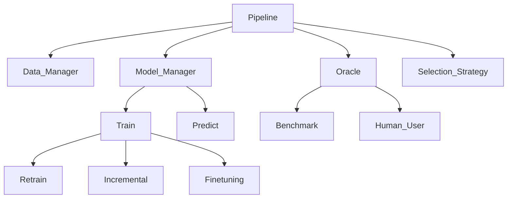

# HumAL

HumAIne Active Learning Platform - An integrated system for human-in-the-loop machine learning workflows, featuring automated ticket classification, resolution generation, and active learning capabilities.

## Architecture


## Features

- **Ticket Classification**: Automated team routing
- **Resolution Generation**: LLM-powered ticket resolution suggestions using RAG
- **Active Learning**: Interactive model training with human feedback
- **Explainable AI**: LIME-based model explanations
- **Modern UI**: React + TypeScript frontend with real-time updates

## Prerequisites

- **Python 3.8+** (for backend)
- **Node.js 18+** (for frontend)
- **uv** or **pip** (for Python package management)
- **npm** (for frontend package management)
- **CUDA Toolkit** (optional, for GPU acceleration - will be auto-detected)

## Quick Start

### 1. Install uv (Optional but Recommended)

**Windows:**
```bash
powershell -c "irm https://astral.sh/uv/install.ps1 | iex"
```

**Unix/Linux/macOS:**
```bash
curl -LsSf https://astral.sh/uv/install.sh | sh
```

### 2. Create and Activate Virtual Environment

```bash
# Create virtual environment with uv (recommended)
uv venv al_api_venv

# Or with Python's built-in venv
python -m venv al_api_venv

# Activate (Windows)
al_api_venv\Scripts\activate

# Activate (Unix/Linux/macOS)
source al_api_venv/bin/activate
```

### 3. Run Automated Installation

```bash
# Basic installation (auto-detects CUDA and package manager)
python install.py

# Force CPU-only installation
python install.py --cpu-only

# Force use of pip instead of uv
python install.py --use-pip
```

The installer will:
- ✓ Auto-detect CUDA and install PyTorch with GPU support (if available)
- ✓ Install all backend dependencies from requirements.txt
- ✓ Install all frontend dependencies
- ✓ Verify the installation and display GPU/CPU status

### 4. Prepare Data and Models

```bash
# Create directories (if they don't exist)

# Windows
mkdir backend\data 
mkddir backend\models

# Unix/Linux/macOS
mkdir -p backend/data backend/models
```

Place the following in `backend/data/`:
- Resolution KB: `User_Request_last_team_ANON.csv`
- Active Learning datasets: `al_demo_train_data.csv`, `al_demo_test_data.csv`, `al_demo_train_labels_dispatch.csv`

Place pre-trained models in `backend/models/`:
- `perfect_team_classifier/` folder
- `ticket_classifier_model/` folder

### 5. Configure Environment

 ```bash
 # Copy .env.example to .env (if .env.example exists)
 # Unix/Linux/macOS
 cp .env.example .env
 
 # Windows PowerShell
 copy .env.example .env
 ```
 
 Edit `.env` and add your OpenAI API key:
 ```
 OPENAI_API_KEY=your-openai-api-key-here
 ```

### 6. Run the Application

**Windows:**
```bash
.\start-dev.bat
```

**Unix/Linux/macOS:**
```bash
chmod +x start-dev.sh  # First time only
./start-dev.sh
```

## Access Points

After starting both services:

- **Frontend Application**: http://localhost:5173
- **Backend API**: http://localhost:8000
- **API Documentation**: http://localhost:8000/docs
- **Interactive API Docs**: http://localhost:8000/redoc

## Available Pages

- **Home** (`/`) - Landing page
- **Training** (`/training`) - Model training interface
- **Dispatch Labeling** (`/dispatch-labeling`) - Label dispatch data
- **Ticket Resolution** (`/resolution-labeling`) - Generate automated responses
- **Inference** (`/inference`) - Run model inference

## Documentation

For manual installation, troubleshooting, development features, and advanced configuration, see [SETUP.md](SETUP.md).

## Project Structure

```
HumAL/
├── backend/              
│   ├── app/              # FastAPI application
│   ├── data/             # CSV datasets
│   └── models/           # Saved models
├── frontend/             # React + Vite frontend
├── start-dev.bat         # Windows startup script
├── start-dev.sh          # Unix/Linux startup script
├── requirements.txt      # Backend dependencies
├── install.py            # Automated dependency installer
└── SETUP.md              # Detailed setup guide
```

## License

See [LICENSE](LICENSE) for details.