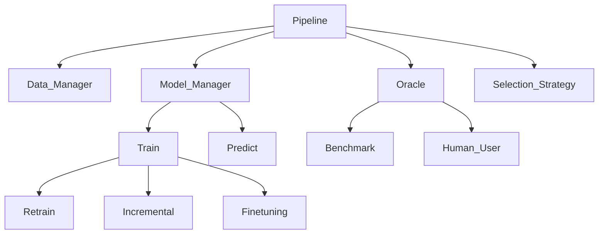

# HumAL Architecture

## System Overview

HumAL is a full-stack human-in-the-loop active learning platform designed for IT ticket classification, automated resolution generation, and interactive model training. The system combines traditional machine learning with modern LLM capabilities and explainable AI.

**Technology Stack:**
- **Backend**: FastAPI (Python 3.8+)
- **Frontend**: React + TypeScript + Vite
- **ML Framework**: scikit-learn, PyTorch
- **NLP**: Sentence Transformers, OpenAI
- **XAI**: LIME
- **Vector Search**: FAISS

---

## High-Level Architecture



---

## System Components

### Backend Architecture

```
backend/
├── app/
│   ├── main.py              # FastAPI application entry point
│   ├── routers/             # API endpoint handlers
│   │   ├── active_learning_router.py
│   │   ├── inference_router.py
│   │   ├── resolution_router.py
│   │   ├── data_router.py
│   │   ├── config_router.py
│   │   ├── xai_router.py
│   │   └── label_creation_router.py
│   ├── services/            # Business logic layer
│   │   ├── active_learning_service.py
│   │   ├── inference_service.py
│   │   ├── resolution_service.py
│   │   ├── data_service.py
│   │   ├── config_service.py
│   │   ├── xai_service.py
│   │   └── data_preprocessing.py
│   ├── core/                # Core system components
│   │   ├── dependencies.py  # Dependency injection
│   │   ├── storage.py       # In-memory state management
│   │   └── rag_system.py    # RAG implementation
│   ├── data_models/         # Pydantic schemas
│   │   ├── active_learning_dm.py
│   │   └── resolution_dm.py
│   ├── config/              # Configuration management
│   │   ├── config.py
│   │   └── resolution_config.py
│   └── utils/               # Utility functions
│       ├── model_utils.py
│       ├── query_strategies.py
│       └── embedding_utils.py
├── data/                    # CSV datasets
├── models/                  # Saved model artifacts
├── embeddings_cache/        # Cached embeddings
└── tests/                   # Test suite
```

---

### Frontend Architecture

```
frontend/
├── src/
│   ├── main.tsx             # Application entry point
│   ├── App.tsx              # Root component with routing
│   ├── pages/               # Route-level components
│   │   ├── Home.tsx
│   │   ├── Training.tsx
│   │   ├── DispatchLabeling.tsx
│   │   ├── TicketResolution.tsx
│   │   └── Inference.tsx
│   ├── components/          # Reusable UI components
│   │   ├── ui/              # shadcn-ui components
│   │   ├── ActiveLearningDashboard.tsx
│   │   ├── TicketCard.tsx
│   │   ├── ModelMetrics.tsx
│   │   └── ExplanationView.tsx
│   ├── services/            # API client layer
│   │   └── api.ts
│   ├── types/               # TypeScript type definitions
│   │   └── api.ts
│   ├── hooks/               # Custom React hooks
│   └── lib/                 # Utility functions
└── public/                  # Static assets
```

---

## Component Details

### 1. API Layer (Routers)

**Purpose**: Handle HTTP requests and route them to appropriate services.

**Key Routers:**

- **active_learning_router.py**: Manages AL instance lifecycle
  - Create new instances
  - Get next samples for labeling
  - Submit labels and trigger training
  
- **inference_router.py**: Model prediction endpoints
  - Run inference on new tickets
  - Batch prediction support
  
- **resolution_router.py**: Automated resolution generation
  - RAG-based ticket resolution
  - Feedback collection
  - Embeddings management
  
- **xai_router.py**: Explainability features
  - LIME explanations
  - Similar ticket search
  
- **data_router.py**: Data access and management
  - Ticket retrieval
  - Team information
  - Label statistics

---

### 2. Service Layer

**Purpose**: Implement business logic and coordinate between components.

**Key Services:**

#### Active Learning Service
- Manages AL pipeline lifecycle
- Coordinates query strategy selection
- Handles model training and evaluation
- Maintains instance state

#### Inference Service
- Loads trained models
- Performs predictions
- Calculates confidence scores
- Manages model versioning

#### Resolution Service
- Implements RAG pipeline
- Integrates with OpenAI GPT
- Manages knowledge base embeddings
- Handles feedback loop

#### XAI Service
- Generates LIME explanations
- Finds similar instances using embeddings

#### Data Service
- Provides data access interface

---

### 3. Core Components

#### Storage (`core/storage.py`)
**Purpose**: In-memory state management for AL instances.

```python
class Storage:
    al_instances_dict: Dict[int, ALInstance]
    model_paths_dict: Dict[int, str]
    data_cache: Dict[str, pd.DataFrame]
    embeddings_cache: Dict[str, np.ndarray]
```

**Features:**
- Singleton pattern for global state
- Instance lifecycle management
- Model persistence tracking
- Data and embeddings caching

#### RAG System (`core/rag_system.py`)
**Purpose**: Retrieval-Augmented Generation for ticket resolution.

**Components:**
1. **Embedding Generation**: Sentence Transformers (all-MiniLM-L6-v2)
2. **Vector Store**: FAISS for similarity search
3. **Retrieval**: Top-k similar tickets
4. **Generation**: OpenAI GPT-4 for response synthesis

**Workflow:**
```
User Query → Embed Query → FAISS Search → Retrieve Top-K
→ Build Context → GPT Prompt → Generate Resolution
```

#### Dependencies (`core/dependencies.py`)
**Purpose**: Dependency injection for services.

```python
def get_al_service() -> ActiveLearningService
def get_inference_service() -> InferenceService
def get_resolution_service() -> ResolutionService
```

---

### 4. Data Models (Pydantic)

**Purpose**: Type-safe request/response schemas with validation.

**Key Models:**

```python
# Active Learning
class NewInstance(BaseModel):
    train_data_path: str
    test_data_path: str
    model_name: str
    query_strategy: str
    batch_size: int
    n_iterations: int

class LabelRequest(BaseModel):
    indices: List[str]
    labels: List[str]

# Resolution
class ResolutionRequest(BaseModel):
    ticket_description: str
    ticket_category: Optional[str]
    user_context: Optional[Dict]

class ResolutionResponse(BaseModel):
    resolution: str
    confidence_score: float
    similar_tickets: List[Dict]
```

---

### 5. Frontend Components

#### Pages
- **Home**: Landing page with feature overview
- **Training**: AL instance creation and configuration
- **DispatchLabeling**: Interactive labeling interface
- **TicketResolution**: Resolution generation and feedback
- **Inference**: Model prediction interface

#### API Service (`services/api.ts`)
**Purpose**: Centralized API client with TypeScript types.

```typescript
export const api = {
  activelearning: {
    createInstance: (data: NewInstance) => Promise<{instance_id: number}>,
    getNext: (id: number, batchSize: number) => Promise<NextBatch>,
    submitLabels: (id: number, labels: LabelRequest) => Promise<Response>
  },
  resolution: {
    process: (request: ResolutionRequest) => Promise<ResolutionResponse>,
    submitFeedback: (feedback: FeedbackRequest) => Promise<Response>
  }
}
```

---

## Data Flow

### Active Learning Workflow

```
1. User Creates Instance
   ↓
2. Frontend → POST /activelearning/new
   ↓
3. AL Service initializes pipeline
   ↓
4. Storage saves instance state
   ↓
5. Return instance_id
   ↓
6. User Requests Next Batch
   ↓
7. Query Strategy selects uncertain samples
   ↓
8. Return unlabeled tickets
   ↓
9. User Submits Labels
   ↓
10. Model retrains incrementally
    ↓
11. Update metrics and state
    ↓
12. Repeat steps 6-11
```

### Resolution Generation Workflow

```
1. User Inputs Ticket Description
   ↓
2. Frontend → POST /resolution/process
   ↓
3. Resolution Service receives request
   ↓
4. Generate embedding for query
   ↓
5. FAISS searches similar tickets
   ↓
6. Retrieve top-k matches from KB
   ↓
7. Build context with similar resolutions
   ↓
8. Send prompt to OpenAI GPT
   ↓
9. GPT generates resolution
   ↓
10. Return resolution + metadata
    ↓
11. User provides feedback (optional)
    ↓
12. Store feedback for improvement
```

### Inference Workflow

```
1. User Inputs New Ticket
   ↓
2. Frontend → POST /activelearning/{id}/infer
   ↓
3. Load trained model from storage
   ↓
4. Preprocess ticket text
   ↓
5. Generate features (embeddings)
   ↓
6. Model predicts class
   ↓
7. Return predictions
   ↓
8. Optional: Generate LIME explanation
```

---

## Machine Learning Pipeline

### Active Learning Components

#### 1. Query Strategies
- **Uncertainty Sampling**: Select instances with lowest confidence
- **Margin Sampling**: Select instances with smallest margin between top-2 classes
- **Entropy Sampling**: Select instances with highest prediction entropy
- **Random Sampling**: Baseline random selection
- **Query by Committee**: Ensemble disagreement

#### 2. Models Supported
- Logistic Regression
- Random Forest
- Support Vector Machine (SVM)

---

## Storage and Persistence

### Model Storage
```
backend/models/
├── {instance_id}/
│   ├── 0.pkl          # Model fromm AL instance 1
│   ├── 1.pkl          # Model fromm AL instance 2
│   └── 2.pkl          # Model fromm AL instance 3
├── perfect_team_classifier/ # Contains pretrained model
└── ticket_classifier_model/  # Contains pretrained model
```

**Format**: Joblib serialized scikit-learn models

### Embeddings Cache
```
backend/embeddings_cache/
└── {dataset}_{model}_{timestamp}.npz
```

**Format**: NumPy compressed arrays (.npz)

**Benefits**:
- Fast loading
- Automatic regeneration if missing
- Version tracking via timestamp

### Data Storage
- **Format**: CSV files
- **Location**: `backend/data/`
- **Structure**: Ticket ID, Description, Team, Resolution

---

## Configuration Management

### Backend Configuration (`config/config.py`)
```python
class Config:
    MODELS = ["LogisticRegression", "RandomForest", "SVM"]
    QUERY_STRATEGIES = ["UncertaintySampling", "MarginSampling"]
    DEFAULT_BATCH_SIZE = 10
    MAX_ITERATIONS = 100
```

### Resolution Configuration (`config/resolution_config.py`)
```python
class ResolutionConfig:
    EMBEDDING_MODEL = "all-MiniLM-L6-v2"
    TOP_K_SIMILAR = 5
    OPENAI_MODEL = "gpt-3.5 Turbo"
    MAX_CONTEXT_LENGTH = 2000
```

### Environment Variables
```bash
OPENAI_API_KEY=sk-...
HOST=0.0.0.0
PORT=8000
DEBUG=True
```