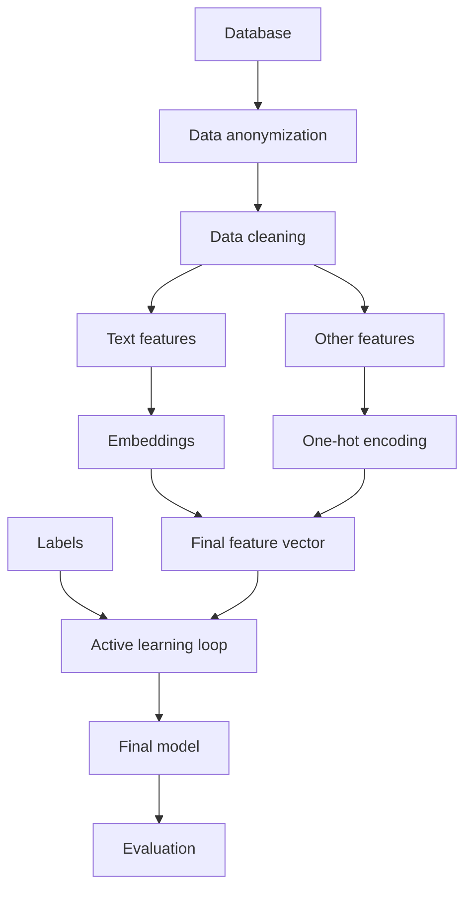
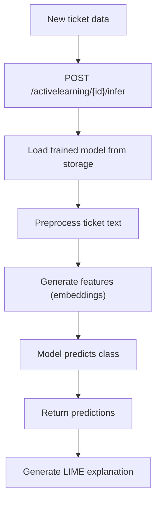

# HumAL Architecture

## System Overview

HumAL is a human-in-the-loop active learning platform designed for IT ticket classification and interactive model training. The system combines traditional machine learning with XAI (explainable AI).

**Technology Stack:**
- **Backend**: FastAPI (Python 3.8+)
- **ML Framework**: scikit-learn, PyTorch
- **NLP**: Sentence Transformers
- **XAI**: LIME
- **Vector Search**: FAISS

---

## High-Level Architecture


---

## System Components

### Backend Architecture

```
backend/
├── app/
│   ├── main.py              # FastAPI application entry point
│   ├── routers/             # API endpoint handlers
│   ├── services/            # Business logic layer
│   ├── core/                # Core system components
│   ├── data_models/         # Pydantic schemas
│   ├── config/              # Configuration management
│   └── utils/               # Utility functions
├── data/                    # CSV datasets
├── models/                  # Saved model artifacts
├── models/                  # Saved model artifacts
└── tests/                   # Test suite
```


## Component Details

### 1. API Layer (Routers)

**Purpose**: Handle HTTP requests and route them to appropriate services.

**Key Routers:**

- **active_learning_router.py**: Manages AL instance lifecycle
  - Create new instances
  - Get next samples for labeling
  - Submit labels and trigger training
  
- **inference_router.py**: Model prediction endpoints
  - Run inference on new tickets
  - Batch prediction support
  
- **xai_router.py**: Explainability features
  - LIME explanations
  - Similar ticket search
  
- **data_router.py**: Data access and management
  - Ticket retrieval
  - Team information
  - Label statistics
  
- **config_router.py**: Configuration management
  - Retrieve available models
  - Retrieve query strategies

---

### 2. Service Layer

**Purpose**: Implement business logic and coordinate between components.

**Key Services:**

#### Active Learning Service
- Manages AL pipeline lifecycle
- Coordinates query strategy selection
- Handles model training and evaluation
- Maintains instance state

#### Inference Service
- Loads trained models
- Performs predictions

#### XAI Service
- Generates LIME explanations
- Finds similar instances using embeddings

#### Data Service
- Provides data access interface

---

### 3. Core Components

#### Storage (`core/storage.py`)
**Purpose**: In-memory state management for AL instances.

```python
class Storage:
    al_instances_dict: Dict[int, ALInstance]
    model_paths_dict: Dict[int, str]
    data_cache: Dict[str, pd.DataFrame]
    embeddings_cache: Dict[str, np.ndarray]
```

**Features:**
- Instance lifecycle management
- Model persistence tracking
- Data and embeddings caching

#### Dependencies (`core/dependencies.py`)
**Purpose**: Dependency injection for services.

```python
def get_al_service() -> ActiveLearningService
def get_inference_service() -> InferenceService
def get_xai_service() -> XAIService
```

---

### 4. Data Models (Pydantic)

**Purpose**: Type-safe request/response schemas with validation.

**Key Models:**

```python
# Active Learning
class NewInstance(BaseModel):
    train_data_path: str
    test_data_path: str
    model_name: str
    query_strategy: str
    batch_size: int
    n_iterations: int

class LabelRequest(BaseModel):
    indices: List[str]
    labels: List[str]
```


---

## Data Flow

### Active Learning


```mermaid
flowchart TD
    A[Database] --> B[Data anonymization]
    B --> C[Data cleaning]

    C --> D[Text features]
    C --> E[Other features]

    D --> F[Embeddings]
    E --> G[One-hot encoding]

    F --> H[Final feature vector]
    G --> H

    I[Labels] --> J[Active learning loop]
    H --> J

    J --> K[Final model]
    K --> L[Evaluation]

```

### Inference Workflow


```mermaid
flowchart TD
    A[New ticket data]
    B["POST /activelearning/{id}/infer"]
    C[Load trained model from storage]
    D[Preprocess ticket text]
    E["Generate features (embeddings)"]
    F[Model predicts class]
    G[Return predictions]
    H[Generate LIME explanation]

    A --> B
    B --> C
    C --> D
    D --> E
    E --> F
    F --> G
    G --> H

```

---

## Machine Learning Pipeline

### Active Learning Components

#### 1. Query Strategies
- **Uncertainty Sampling Least Confidence**: Select instances with lowest confidence
- **Uncertainty Sampling Margin Sampling**: Select instances with smallest margin between top-2 classes
- **Uncertainty Sampling Entropy**: Select instances with highest prediction entropy
- **Random Sampling**: Baseline random selection
- **Query by Committee**: Ensemble disagreement

#### 2. Models Supported
- Logistic Regression
- Random Forest
- Support Vector Machine (SVM)

---

## Storage and Persistence

### Model Storage
```
backend/models/
├── {instance_id}/
│   ├── 0.pkl          # Model fromm AL instance 1
│   ├── 1.pkl          # Model fromm AL instance 2
│   └── 2.pkl          # Model fromm AL instance 3
├── perfect_team_classifier/ # Contains pretrained model
└── ticket_classifier_model/  # Contains pretrained model
```

**Format**: Joblib serialized scikit-learn models

### Embeddings Cache
```
backend/embeddings_cache/
└── {dataset}_{model}_{timestamp}.npz
```

**Format**: NumPy compressed arrays (.npz)

### Data Storage
- **Format**: CSV files
- **Location**: `backend/data/`