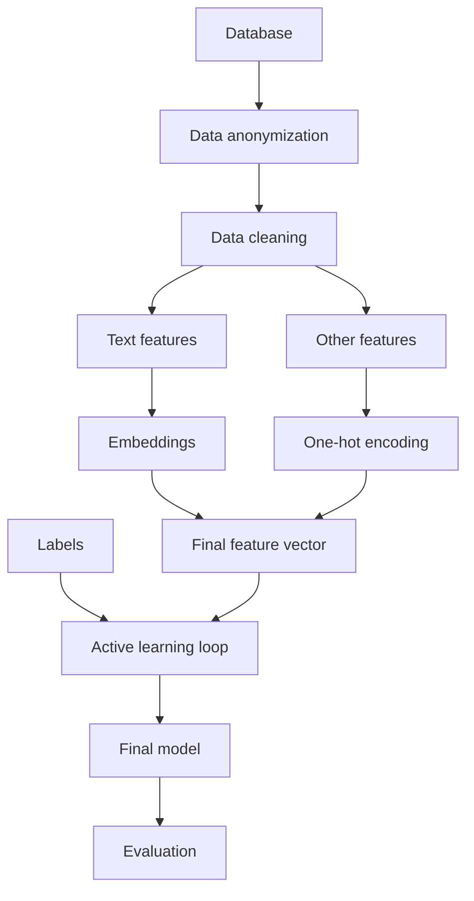
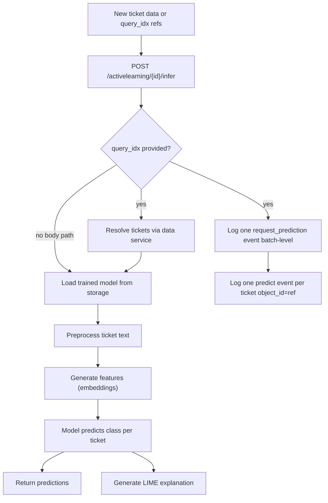

# HumAL Architecture

## System Overview

HumAL is a human-in-the-loop active learning platform designed for IT ticket classification and interactive model training. The system combines traditional machine learning with XAI (explainable AI).

**Technology Stack:**
- **Backend**: FastAPI (Python 3.8+)
- **ML Framework**: scikit-learn, PyTorch
- **NLP**: Sentence Transformers
- **XAI**: LIME
- **Vector Search**: FAISS

---

## High-Level Architecture


---

## System Components

### Backend Architecture

```
backend/
├── app/
│   ├── main.py              # FastAPI application entry point
│   ├── routers/             # API endpoint handlers
│   ├── services/            # Business logic layer
│   ├── core/                # Core system components
│   ├── data_models/         # Pydantic schemas
│   ├── config/              # Configuration management
│   └── utils/               # Utility functions
├── data/                    # CSV datasets
├── models/                  # Saved model artifacts
├── models/                  # Saved model artifacts
└── tests/                   # Test suite
```


## Component Details

### 1. API Layer (Routers)

**Purpose**: Handle HTTP requests and route them to appropriate services.

**Key Routers:**

- **user_router.py**: User management
  - Register new users
  - Authenticate users and issue JWT access tokens
  - Return authenticated user identity
  
- **active_learning_router.py**: Manages AL instance lifecycle
  - Create new instances (auto-associated with authenticated user)
  - Get next samples for labeling
  - Submit labels and trigger training
  - Endpoints enforce AL-instance ownership via `user_id` match
  
- **inference_router.py**: Model prediction endpoints
  - Run inference on new tickets
  - Batch prediction support
  - Endpoints enforce AL-instance ownership via `user_id` match
  
- **xai_router.py**: Explainability features
  - LIME explanations
  - Similar ticket search
  - Async XAI job management
  - Endpoints enforce AL-instance ownership via `user_id` match
  
- **data_router.py**: Data access and management
  - Ticket retrieval
  - Team information
  - Label statistics
  
- **config_router.py**: Configuration management
  - Retrieve available models
  - Retrieve query strategies

---

### 2. Service Layer

**Purpose**: Implement business logic and coordinate between components.

**Key Services:**

#### Active Learning Service
- Manages AL pipeline lifecycle
- Coordinates query strategy selection
- Handles model training and evaluation
- Maintains instance state

#### Inference Service
- Loads trained models
- Performs predictions

#### XAI Service
- Generates LIME explanations
- Finds similar instances using embeddings

#### Data Service
- Provides data access interface

---

### 3. Core Components

#### Storage (`core/storage.py` and `core/minio_client.py`)
**Purpose**: In-memory state management for AL instances and MinIO persistence.

MinIO JSON dumps use `sort_keys=False` to preserve event insertion order for audit-trail consistency.

```python
class Storage:
    al_instances_dict: Dict[int, ALInstance]
    model_paths_dict: Dict[int, str]
    data_cache: Dict[str, pd.DataFrame]
    embeddings_cache: Dict[str, np.ndarray]
```

**Features:**
- Instance lifecycle management
- Model persistence tracking
- Data and embeddings caching

#### Dependencies (`core/dependencies.py`)
**Purpose**: Dependency injection for services and authentication.

```python
def get_al_service() -> ActiveLearningService
def get_inference_service() -> InferenceService
def get_xai_service() -> XAIService
def get_current_user() -> dict
```

**Authentication:**
- `get_current_user` resolves the `Authorization: Bearer <jwt>` header to a user dict via the `sub` claim and `DuckDbPersistenceService.get_user`
- Returns the system user (`00000000-0000-0000-0000-000000000000`) when no token is sent
- Raises `401` for invalid or expired tokens
- All AL instance and XAI endpoints use `get_current_user` via FastAPI `Depends()` and enforce that the instance's `user_id` matches the current user

---

### 4. Data Models (Pydantic)

**Purpose**: Type-safe request/response schemas with validation.

**Key Models:**

```python
# Active Learning
class NewInstance(BaseModel):
    model_name: str
    qs_strategy: str
    class_list: List[str]
    train_data_path: str | None = None
    test_data_path: str | None = None

class LabelRequest(BaseModel):
    query_idx: List[str | int]
    labels: List[str | int | None]

# User Management
class UserRegisterRequest(BaseModel):
    username: str
    password: str

class UserResponse(BaseModel):
    user_id: str
    username: str
```


---

## Data Flow

### Active Learning


```mermaid
flowchart TD
    A[Database] --> B[Data anonymization]
    B --> C[Data cleaning]

    C --> D[Text features]
    C --> E[Other features]

    D --> F[Embeddings]
    E --> G[One-hot encoding]

    F --> H[Final feature vector]
    G --> H

    I[Labels] --> J[Active learning loop]
    H --> J

    J --> K[Final model]
    K --> L[Evaluation]

```

### Inference Workflow


```mermaid
flowchart TD
    A[New ticket data or query_idx refs]
    B["POST /activelearning/{id}/infer"]
    C{query_idx provided?}
    D[Resolve tickets via data service]
    E[Load trained model from storage]
    F[Preprocess ticket text]
    G["Generate features (embeddings)"]
    H[Model predicts class per ticket]
    I[Return predictions]
    J[Log one request_prediction event batch-level]
    K[Log one predict event per ticket object_id=ref]
    L[Generate LIME explanation]

    A --> B
    B --> C
    C -- yes --> D
    C -- no body path --> E
    D --> E
    E --> F
    F --> G
    G --> H
    H --> I
    C -- yes --> J
    J --> K
    H --> L

```

---

## Machine Learning Pipeline

### Active Learning Components

#### 1. Query Strategies
- **Uncertainty Sampling Least Confidence**: Select instances with lowest confidence
- **Uncertainty Sampling Margin Sampling**: Select instances with smallest margin between top-2 classes
- **Uncertainty Sampling Entropy**: Select instances with highest prediction entropy
- **Random Sampling**: Baseline random selection
- **Query by Committee**: Ensemble disagreement

#### 2. Models Supported
- Logistic Regression
- Random Forest
- Support Vector Machine (SVM)

---

## Storage and Persistence

The DuckDB persistence layer stores active-learning and XAI metadata in staged tables so partial updates can be merged without losing earlier non-null values.

### User-Aware Ownership

All AL instances are owned by a user via the `user_id` column (`UUID NOT NULL DEFAULT system_user`). The system user UUID is `00000000-0000-0000-0000-000000000000`. JWT authentication binds requests to a user, and AL-instance operations are scoped to the owner. When no token is provided, requests fall back to the system user.

### Label Decision Metadata
- `label_decisions` keeps decision metadata from `/activelearning/{al_instance_id}/label-with-info`, `/xai/{al_instance_id}/nearest_ticket`, and `/xai/jobs/{job_id}`.
- Rows are merged by `(al_instance_id, ref)` so label information, nearest neighbors, and XAI results can arrive in separate calls.
- `similar_tickets` and `xai_result` are stored as JSON payloads, while the human review fields stay as regular columns for querying.

### AL Events (Audit Trail)
- `al_events` stores a chronological audit trail of every action in an AL instance.
- Each event carries:
  - `action` — the event type. Actual values used in code: `"confirm_label"`, `"override_label"`, `"request_prediction"`, `"predict"`, `"lime"`, `"similar_tickets"`, `"benchmark_export"`, `"create_al_instance"`, `"request_batch"`, `"select_batch"`, `"train"`, `"evaluate"`, `"model_checkpoint"`.
  - `actor_type` — `"system"` (orchestrator) or `"ai"` (model/agent) or `"human"` (label).
  - `agent` — e.g. `"orchestrator"`, `"classifier_model"`, `"xai_lime"`, `"xai_nearest"`, `"human_reviewer"`.
  - `object_id` — the associated ticket reference (nullable). For per-ticket events, this is the ticket ref. For batch-level events (e.g. `request_prediction`), this is `null` and the refs are in `payload.ticket_ids`.
  - `payload` — JSON column with contextual data: predictions, probabilities, top features, ticket lists, request sizes, etc.
- There are no dedicated `predicted_class`, `ticket_ref`, or `meta_block` columns; predicted class and per-ticket refs live inside the JSON `payload` (or in the per-ref `object_id`).

### HAIC Benchmarking Artifact
- Benchmarking is an **automatic internal MinIO export** triggered by `BenchmarkingService.export_if_needed` when the labeled-event count threshold is met (no HTTP endpoint exists).
- The export is assembled by `app/utils/haic_artifact.py::build_decisions_artifact`.
- The actual artifact shape is:
  ```json
  {
    "artifact_schema": "haic.active_learning.v1",
    "schema_version": "1.0.0",
    "session_id": "<uuid>",
    "meta": {
      "pilot_tag": "...",
      "application": "...",
      "ai_system": "...",
      "task": "...",
      "human": "...",
      "t_start": "...",
      "t_end": "..."
    },
    "decisions": [ ... per-ticket decision rows ... ],
    "events": [ ... per system event row ... ]
  }
  ```
- There is no `classifier_name`, `evaluated_by`, `evaluation_timestamp`, or `meta_block` field in the artifact. The `meta` dict supplies session metadata.

### Model Storage
```
backend/models/
├── {instance_id}/
│   ├── 0.pkl          # Model fromm AL instance 1
│   ├── 1.pkl          # Model fromm AL instance 2
│   └── 2.pkl          # Model fromm AL instance 3
├── perfect_team_classifier/ # Contains pretrained model
└── ticket_classifier_model/  # Contains pretrained model
```

**Format**: Joblib serialized scikit-learn models

### Embeddings Cache
```
backend/embeddings_cache/
└── {dataset}_{model}_{timestamp}.npz
```

**Format**: NumPy compressed arrays (.npz)

### Data Storage
- **Format**: CSV files
- **Location**: `backend/data/`

#### Instance Delegation

The system supports **instance delegation**, allowing owners to share their AL instances with other users. Delegated users gain full access (label, infer, XAI, save, delete) while the owner retains access.

**Delegation Model:**
- Delegations are tracked in the `instance_delegations` DuckDB table with columns: `al_instance_id`, `delegate_user_id`, `granted_by`, `granted_at`.
- A user can be delegated an instance only once (composite primary key prevents duplicates).
- Delegation is by username (user-friendly) but stored as UUID internally.
- Delegations are automatically cleaned up when an instance is deleted.

**Authorization Flow:**
1. Check if the current user is the instance owner (`instance.user_id == current_user.user_id`).
2. If not, check if the user is a delegate (`instance_delegations` table lookup).
3. If neither, reject with HTTP 403.

**Instance Listing:**
- `GET /activelearning/instances` returns both owned and delegated instances, indistinguishable from each other.
- This allows delegates to work with delegated instances seamlessly.

**Management Endpoints:**
- `POST /activelearning/{id}/delegate` — Grant access to a user by username.
- `DELETE /activelearning/{id}/delegate/{username}` — Revoke a user's access.
- `GET /activelearning/{id}/delegates` — List all delegates (owner-only).