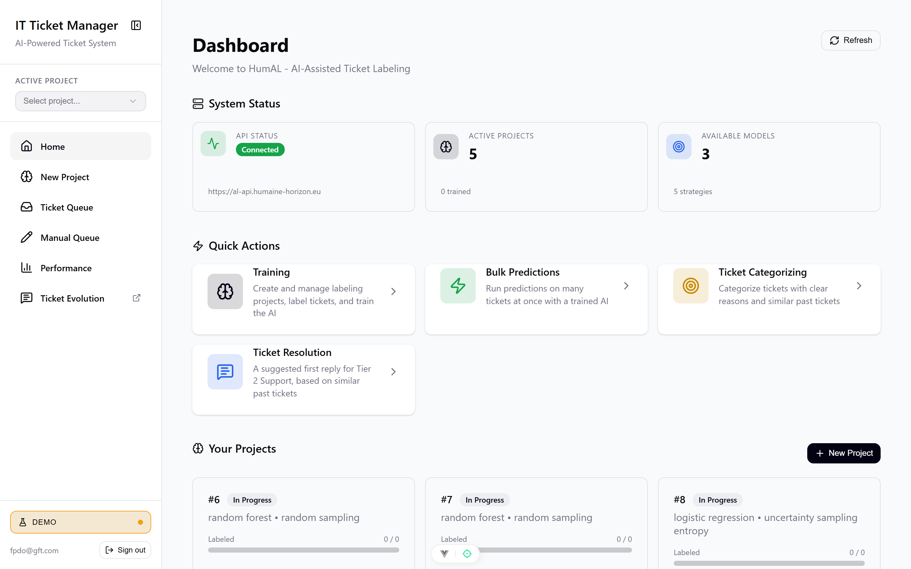
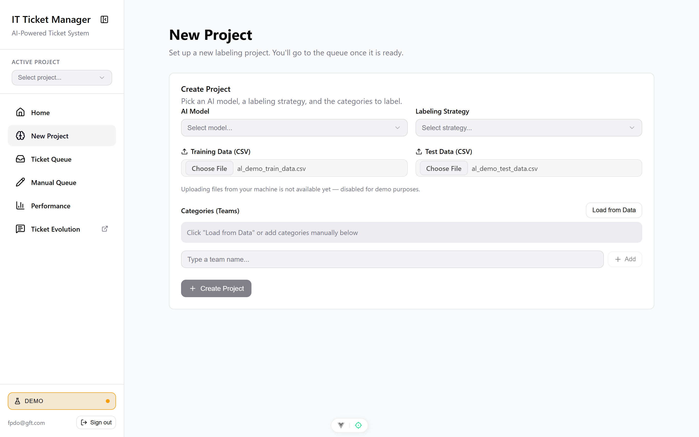
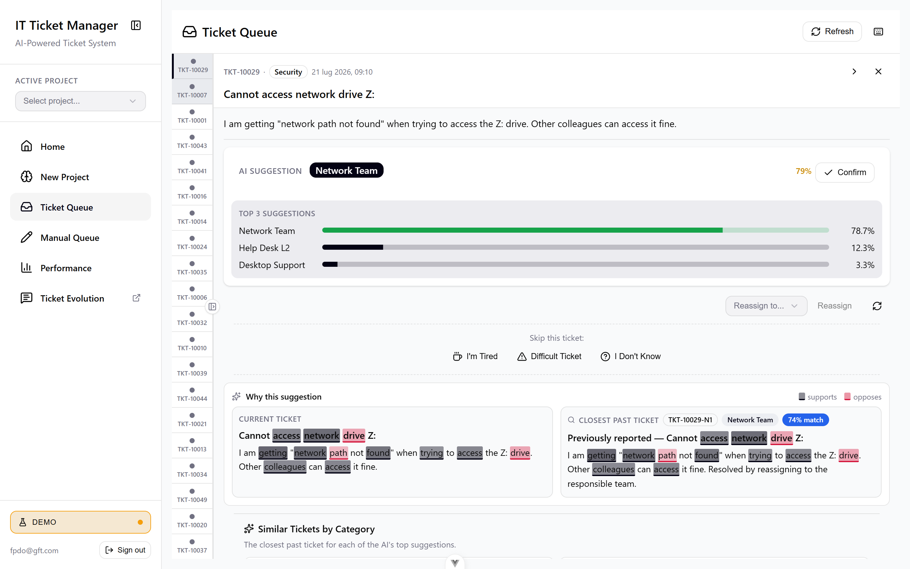
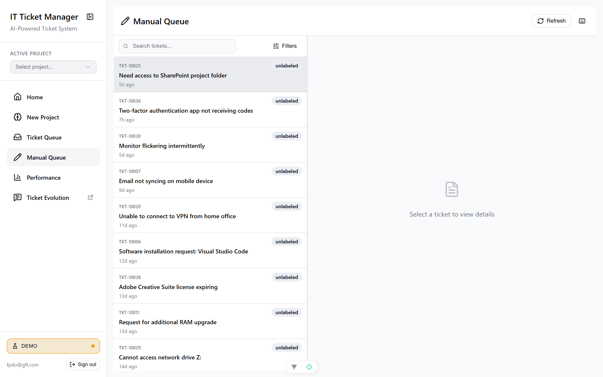
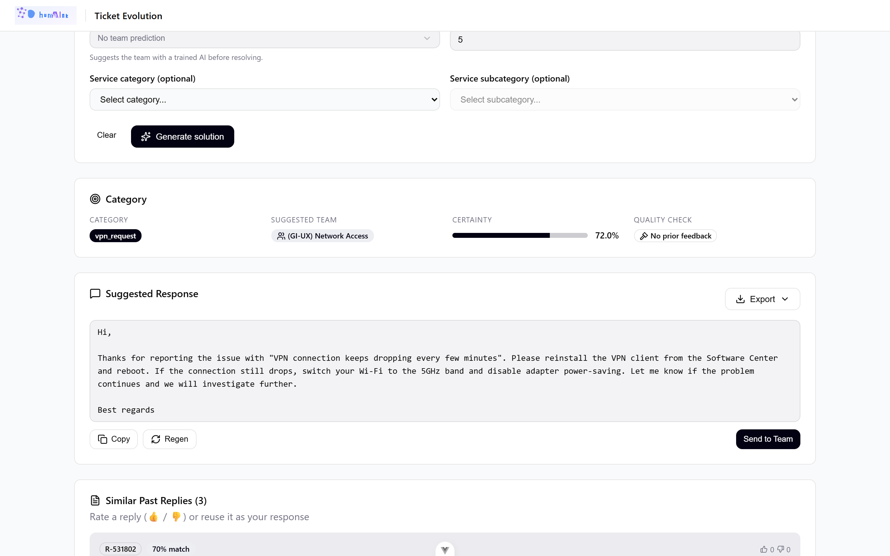
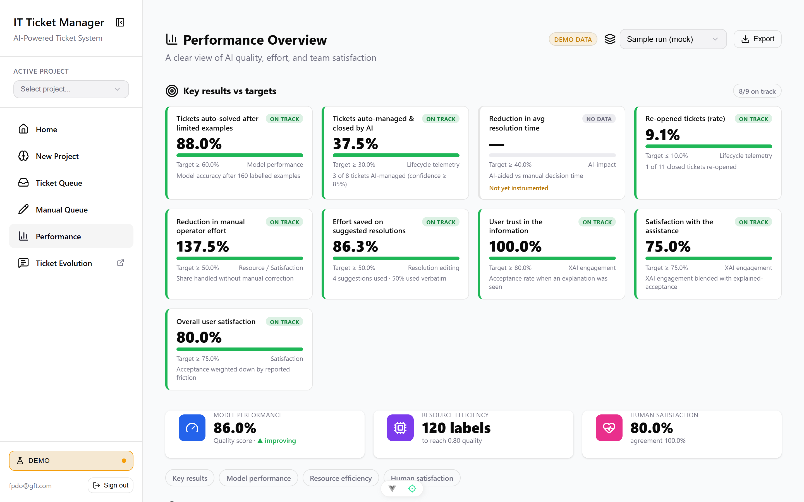
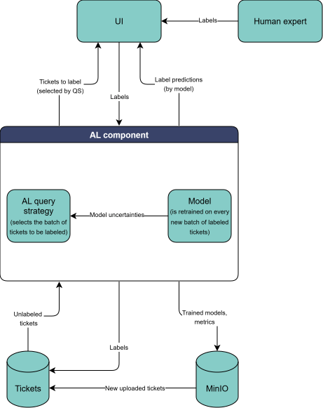

<!-- _class: title -->

# Human-in-the-Loop AI for IT Ticket Triage & Resolution

## AI proposes · Humans decide · The system learns — and proves it

*IT Ticket Manager — AI-Powered Ticket System · Product demo & presenter guide*

<!--
PRESENTER SCRIPT — Opening (30s)
"Hi everyone. Today I'll show humAIne — an AI-powered IT ticket system built around one principle: the AI does the heavy lifting, but a human always stays in control, and every decision is measured."
- Say the tagline out loud: AI proposes, humans decide, the system learns and proves it.
- Tell them the plan: a short story, then a live walkthrough of the app, then the numbers.
- Housekeeping: "I'll take questions at the end, but stop me anytime."
-->

---

<!-- _class: dense -->

## How to run this session

**Agenda (~20 min)** — Story (4 min) → Live walkthrough (12 min) → Metrics & value (4 min) → Q&A.

**Before you start (setup checklist):**
- Start the frontend dev server, open **http://localhost:5173** and sign in.
- Toggle the sidebar switch to **Demo** (orange dot) → the whole app runs on seeded data, **no backend needed**.
- Have two tabs ready: the main app, and **Ticket Evolution** (it opens in a new tab).
- Zoom the browser to ~110–125% so the room can read the UI.

> This deck doubles as your script — **speaker notes on every slide** contain what to say and what to click.

<!--
PRESENTER SCRIPT — Setup (45s)
- Emphasize Demo mode: "Everything you'll see runs on realistic seeded data, so the demo never depends on a live model or network."
- The green/orange dot in the sidebar is the Live/Demo toggle. Orange = Demo.
- Ticket Evolution opens in its own tab by design (it's the Tier-2 tool) — pre-open it to avoid fumbling.
- Tell the audience these are real screens from the product, not mockups.
- If presenting slides only (no live app), the screenshots carry the full story.
-->

---

## The problem we're solving

- IT service desks are **flooded** with tickets — triage is slow, manual and repetitive.
- Routing to the **wrong team** and writing **first replies** from scratch waste hours every day.
- Teams don't trust **black-box AI** they can't understand or correct.
- Leaders lack the **evidence** to know whether automation is actually working.

> The goal: cut manual effort and resolution time **without** handing control to an opaque model.

<!--
PRESENTER SCRIPT — Problem (1 min)
- Land the pain: "Every mis-routed ticket bounces between teams for hours. Every first reply is written from a blank page."
- Name the two blockers to AI adoption: trust ("is it a black box?") and proof ("is it actually helping?").
- Transition: "So we built the system around solving all four of these at once."
- If you know the audience's numbers (ticket volume, avg handling time), quote them here.
-->

---

## Our answer in one line

> **The AI drafts the triage and the reply. A human stays in control. Every decision teaches the model — and everything is measured.**

### 1 · Classify & Resolve
Auto-triage + AI-drafted replies

### 2 · Explain
Show *why*, not just *what*

### 3 · Learn
Human feedback improves the model

### 4 · Prove
Benchmark & measure impact

<!--
PRESENTER SCRIPT — Four pillars (45s)
- Read the one-liner slowly; it's the thesis of the whole talk.
- Point to each pillar: Classify & Resolve (the work), Explain (trust), Learn (it gets better), Prove (the numbers).
- Tell them: "The rest of the demo is just these four pillars, shown live."
-->

---

## Who uses it

| Persona | Goal | Where in the app |
|---|---|---|
| **Ticket Labeler / Agent** | Confirm or correct AI triage, fast | Ticket Queue |
| **Support Operator (Tier 2)** | Send a quality first reply in seconds | Ticket Evolution |
| **Team Lead / Analyst** | Track accuracy, effort saved & KPIs | Performance |

*One human-in-the-loop workflow, three points of value.*

<!--
PRESENTER SCRIPT — Personas (30s)
- Anchor each persona to a screen so the audience knows who they are "playing" during the demo.
- "I'll walk you through the app as all three: first the labeler, then the Tier-2 operator, then the team lead."
-->

---

## The journey we'll walk through

Login

→

Home

→

New Project

→

Ticket Queue ↻ label &amp; learn

→

Ticket Evolution

→

Performance

*The rest of the deck follows this exact path — each screen with the idea behind it, then a close-up of its inputs and buttons.*

<!--
PRESENTER SCRIPT — Journey map (30s)
- Trace the arrows with your cursor/pointer: this is literally the click-path you'll follow live.
- Note the loop on Ticket Queue: labeling feeds back into the model continuously.
- "Every screen has two slides: the big picture, then a close-up of the controls."
-->

---

<!-- _class: section -->

# The flow, step by step

## Each screen — the concept, then the controls

---

<!-- _class: shot -->

Step 1 · Home

## Sign in → the operator's home base

**Flow:** A secure JWT login opens the **dashboard** — API status, active projects and available AI models — with **quick actions** into every workflow.

<!--
PRESENTER SCRIPT — Home (1 min)
What to say: "After signing in, the operator lands on a control tower for the whole system."
What to click / point at:
- Top-left: 'System Status' — API Status badge (Connected), Active Projects count, Available Models count. "Green means the backend is healthy."
- 'Quick Actions' cards jump straight into each workflow.
- 'Your Projects' lists labeling projects with a Trained / In Progress badge and an Open button.
- The Refresh button re-checks system status.
Transition: "Let's create a project — that's where we choose the AI and how it learns."
-->

---

<!-- _class: dense -->

Step 1 · Home — the controls

## What's on the dashboard

| Element | What it tells you / does |
|---|---|
| **System Status → API Status** | Backend health: *Connected / Checking… / Disconnected* |
| **Active Projects** · *X trained* | How many labeling projects exist, how many are trained |
| **Available Models** · *X strategies* | AI models and labeling strategies ready to use |
| **Quick Actions** | Shortcut cards: *Training, Bulk Predictions, Ticket Categorizing, Ticket Resolution* |
| **Your Projects** → **Open** | Jump into an existing project; badge shows *Trained / In Progress* |
| **New Project** / **Refresh** | Start a new project · re-check status |

<!--
PRESENTER SCRIPT — Home controls (30s)
- Use this slide only if the audience is hands-on/technical or asks "what does each part do?"
- For a business audience, skim it: "Status up top, shortcuts in the middle, your projects at the bottom."
-->

---

<!-- _class: shot -->

Step 2 · New Project

## Choose the AI — *and how it learns*

- Pick an **AI Model** and the **Categories (Teams)** to route to.
- Choose a **Labeling Strategy** — *uncertainty, entropy, margin, query-by-committee, random* — deciding **which tickets the AI asks a human about first**.

> This is **active learning**: spend human effort on the most informative tickets.

<!--
PRESENTER SCRIPT — New Project (1 min)
What to say: "Setting up a project takes under a minute and it's where the 'human-in-the-loop' magic is configured."
What to click:
- 'AI Model' dropdown → pick a model (e.g., SVM / Logistic Regression). "This is the classifier that will learn to route tickets."
- 'Labeling Strategy' dropdown → pick 'Uncertainty'. KEY POINT: "This decides which tickets we ask the human to label first — the ones the AI is least sure about, so every label teaches it the most."
- 'Categories (Teams)' → click 'Load from Data' to auto-fill the teams from the dataset, or type one and 'Add'.
- Click 'Create Project' → it takes you to the queue.
Note: file upload is disabled in the demo (fixed dataset) — mention if asked.
-->

---

<!-- _class: dense -->

Step 2 · New Project — the controls

## Every input & button

| Control | What it does |
|---|---|
| **AI Model** (dropdown) | The ML algorithm that learns to route tickets |
| **Labeling Strategy** (dropdown) | Picks *which* tickets to ask the human about first (active learning) |
| **Training / Test Data (CSV)** | Data source *(fixed in the demo; upload disabled)* |
| **Download CSV Template** | Gives the exact columns: `title_anon, description_anon, service_name, …` |
| **Categories (Teams)** → **Load from Data** | Auto-fills the routing categories from the dataset |
| **Type a team name… → Add** / chip **✕** | Add or remove categories manually |
| **Create Project** | Creates the instance and opens the Ticket Queue *(needs model + strategy + categories)* |

<!--
PRESENTER SCRIPT — New Project controls (40s)
- 'Load from Data' is the fast path — one click fills all the teams.
- The 'Create Project' button stays disabled until model + strategy + at least one category are set — a good moment to explain the minimum recipe.
- If asked about real data onboarding: "In production you upload your own CSV; the template button shows the exact format."
-->

---

<!-- _class: shot -->

Step 3 · Ticket Queue

## AI triage — *Classification*

The AI answers **two questions at once**, each with a **confidence score**: **what kind of ticket** (13+ types) and **which team** handles it (17 teams). Here: **Application Support · 84%**, with a top‑3 breakdown.

> Powered by sentence embeddings + fine-tuned language models — no hand-written rules.

<!--
PRESENTER SCRIPT — Ticket Queue (1.5 min)
What to say: "This is where a labeler spends their day — and where the AI earns its trust."
What to click:
- Select the first ticket in the list. The right panel shows the ticket, then the AI's suggestion.
- Point at the big prediction: 'Application Support · 84%' and the top-3 bars. "The AI is 84% confident, and here are its next two guesses."
- 'Get AI Suggestion' re-runs the model if needed; 'Confirm' accepts it (keyboard: c); 'Reassign to…' lets you override.
- Confidence colour-codes: green ≥80%, amber ≥50%, red below — the labeler instantly sees when to look closer.
Transition: "But would you trust 84% without knowing why? That's the next screen."
-->

---

<!-- _class: dense -->

Step 3 · Ticket Queue — the controls

## Find, decide, move on

| Control | What it does |
|---|---|
| **Search / Filters / Sort** | Find tickets; sort by *Newest* or *Certainty (High→Low)* |
| **Get AI Suggestion** | Runs the model on the selected ticket |
| **Confirm** (<kbd>c</kbd>) | Accept the AI's team as the label |
| **Reassign to… → Reassign** (<kbd>1</kbd>–<kbd>9</kbd>) | Override with the correct team |
| **Skip:** *I'm Tired · Difficult Ticket · I Don't Know* | Labeled feedback instead of a guess |
| **Bulk select** (<kbd>x</kbd>) · **Select all** (<kbd>Shift</kbd>+<kbd>a</kbd>) | Label many tickets at once |
| **Break modal** | Nudges a pause — *"quality matters more than speed"* |

<!--
PRESENTER SCRIPT — Queue controls (45s)
- The 'Skip with a reason' buttons are a highlight: instead of a bad guess, the labeler tells us *why* they skipped (tired / too hard / unsure) — that's honest signal for the model and for wellbeing analytics.
- Bulk actions + number keys make high-volume labeling fast — show 'x' then a number if time allows.
- The Break modal shows we care about labeler wellbeing and label quality, not just throughput.
-->

---

<!-- _class: shot -->

Step 3 · detail

## "Why this suggestion?" — *Explainability*

- **Highlighted words** show what **supports** vs. **opposes** the prediction.
- The **closest past ticket (86% match)** gives the agent concrete evidence.
- Toggle **Show / Hide Details** to expand the word-by-word weights.

> No black box — explanations build trust, speed decisions, and help catch mistakes.

<!--
PRESENTER SCRIPT — Explainability (1 min)
What to say: "This is the trust layer — the difference between 'the AI said so' and 'here's why.'"
What to click / point at:
- 'Why this suggestion?' panel — the highlighted words are what drove the prediction (LIME). Green supports, red opposes.
- 'Similar Tickets by Category' — the closest resolved ticket for each top guess, with a match %. "The labeler can open a real precedent."
- Toggle 'Show Details' for the ranked word weights.
Key line: "When the AI is wrong, the explanation makes it obvious — the labeler catches it in seconds instead of trusting blindly."
-->

---

<!-- _class: dense -->

Power-user tip

## Keyboard shortcuts — label at speed

| Key | Action | | Key | Action |
|---|---|---|---|---|
| <kbd>j</kbd> / <kbd>↓</kbd> | Next ticket | | <kbd>c</kbd> | Confirm prediction |
| <kbd>k</kbd> / <kbd>↑</kbd> | Previous ticket | | <kbd>1</kbd>–<kbd>9</kbd> | Assign to team 1–9 |
| <kbd>x</kbd> | Toggle bulk select | | <kbd>Shift</kbd>+<kbd>a</kbd> | Select all visible |
| <kbd>Esc</kbd> | Close / clear | | <kbd>?</kbd> | Show shortcuts |

*A trained labeler never leaves the keyboard — read, decide, next.*

<!--
PRESENTER SCRIPT — Shortcuts (20s)
- Optional slide; great for an operations audience worried about speed.
- "Confirm-and-next is a single keystroke; the whole queue can be cleared without touching the mouse."
-->

---

Step 4 · Confirm or correct

## The learning loop — *Human feedback*

Strategy picks the most useful ticket

→

Agent reviews AI + explanation

→

Confirm or override

→

Model retrains

→

Accuracy up, uncertainty down

↻ repeats — every click makes the model better

**Every click is feedback.** The model retrains, grows more confident, and reaches target accuracy with **fewer labels** than random sampling — human effort goes only where the model is unsure.

<!--
PRESENTER SCRIPT — Learning loop (45s)
- This is the "Learn" pillar. Walk the arrows.
- The punchline: because the strategy picks the *most informative* tickets, we hit target accuracy with far fewer labels than labeling at random — that's real human time saved.
- "Confirm teaches it it's right; override teaches it it's wrong. Both are gold."
-->

---

<!-- _class: shot -->

Step 5 · Manual Queue

## Bootstrap & ground truth

**Flow:** The same queue **without AI** — pick the team from a dropdown and **Confirm**. Used to gather the first labels before the model is trained, or to check the model against unaided human judgment.

<!--
PRESENTER SCRIPT — Manual Queue (40s)
What to say: "Before the AI knows anything, we need a few honest human labels — that's the Manual Queue."
- No predictions, no explanations — just the ticket, a 'Select team…' dropdown, and 'Confirm'.
- Two uses: (1) bootstrap the very first training data, (2) audit — hide the AI to measure unaided human accuracy as a baseline.
- Same keyboard shortcuts as the AI queue.
-->

---

<!-- _class: shot -->

Step 6 · Ticket Evolution

## An AI-drafted first reply — *Resolution*

1. **Retrieve** similar past tickets
2. **Rank** by meaning + category + quality
3. **Draft** a reply
4. **Human approves / edits**

Here: `vpn_request` → *Network Access* (72%) with a ready-to-send reply.

> Each approved answer **instantly grows the knowledge base**.

<!--
PRESENTER SCRIPT — Ticket Evolution (1.5 min)
What to say: "Now the Tier-2 operator's tool — turning a routed ticket into a sent reply in seconds."
What to click:
- Type a Title + Description (or use 'Pick a ticket' to pull one you just labeled).
- Click 'Generate solution'.
- Walk the result: 'Category' = vpn_request, 'Suggested Team' = Network Access, 'Certainty' 72%, and a 'Quality check' badge showing whether past feedback was applied.
- Scroll to 'Suggested Response' — a ready-to-send draft the operator can edit.
- Below: 'Similar Past Replies' with match % and 👍/👎 votes — real precedents.
Key line: "Approve it and it joins the knowledge base — the next similar ticket gets an even better draft. No retraining wait."
-->

---

<!-- _class: dense -->

Step 6 · Ticket Evolution — the controls

## From ticket to sent reply

| Control | What it does |
|---|---|
| **Title · Description** | The incoming ticket *(required to generate)* |
| **AI model (optional)** | Predict the team with a trained model first |
| **Suggestions to retrieve** (1–20) | How many similar past replies to pull |
| **Service category / subcategory** | Sharpen retrieval to the right area |
| **Generate solution** | Classify + draft a reply + fetch precedents |
| **Certainty · Quality check** | Team confidence · whether community feedback was applied |
| **Suggested Response** → **Copy · Regen · Send to Team · Export** | Edit & use the draft; *Send to Team* saves it to the KB |
| **Similar Past Replies** → 👍 / 👎 · **Use this reply** | Rate a precedent or reuse it verbatim |
| **Pick a ticket** (drawer) | Pull a ticket you already labeled in the queue |

<!--
PRESENTER SCRIPT — Resolution controls (45s)
- 'Suggestions to retrieve' = the top-K knob for the RAG search; more = more precedents, slower.
- 'Send to Team' is the money button: it saves the approved reply and grows the knowledge base incrementally.
- 👍/👎 on precedents feed the 'Quality check' — the community teaches the retrieval what's actually helpful.
-->

---

<!-- _class: shot -->

Step 7 · Performance

## Proving it works — *Benchmarking*

Four pillars, live:
- **Model performance** — F1, uncertainty
- **Resource efficiency** — labels/hour, samples-to-target
- **Human satisfaction** — accept vs. override
- **Programme KPIs** vs. targets

<!--
PRESENTER SCRIPT — Performance (1 min)
What to say: "Every click in the demo is instrumented — this page turns it into evidence."
What to point at:
- Top: 'Key results vs targets' scorecards with On track / At risk badges.
- Three pillar cards: Model performance (F1 + trend), Resource efficiency (labels to reach quality), Human satisfaction (agreement %).
- 'Export' saves a JSON snapshot for reporting.
- Note the Demo/Live badge — here it's demo data; in production it reads from the live analytics API.
-->

---

<!-- _class: dense -->

Step 7 · Performance — the KPIs

## Reading the scorecards

Each KPI shows a **value**, a **target** and a **status** — **On track** · *At risk* · *Off target* · *No data*.

| KPI | What it measures | Target |
|---|---|---|
| **F1 score** | Overall routing accuracy across all teams | ≥ 0.80 |
| **Auto-solve rate** | Tickets fully resolved by AI, no human touch | ≥ 60% |
| **AI-managed rate** | Tickets handled with AI assistance | ≥ 30% |
| **Resolution-time reduction** | Faster handling vs. the manual baseline | ≥ 40% |
| **Reopen rate** | Closed tickets that bounce back *(quality guardrail)* | ≤ 10% |
| **Manual-effort reduction** | Human time saved vs. baseline | ≥ 50% |
| **Trust / Satisfaction** | Operator confidence & sentiment in the AI | ≥ 80% / 75% |

*Three headline pillars back these up: **Model performance** (F1 + trend) · **Resource efficiency** (labels to reach 0.80, decisions/hour) · **Human satisfaction** (acceptance %).*

<!--
PRESENTER SCRIPT — KPI detail (1 min)
What to say: "Each card is a promise with a number and a target — green when we're on track, amber when at risk."
Walk a few:
- 'F1 score' is the single best measure of routing accuracy; target 0.80.
- 'Auto-solve' and 'AI-managed' show how much work the AI takes off the team's plate (60% / 30% targets).
- 'Reopen rate' is the safety guardrail — if auto-solved tickets bounce back above 10%, we pull back automation.
- 'Manual-effort reduction' and 'Trust/Satisfaction' close the loop: less work, and people actually trust it.
Key line: "Every one of these is computed from the clicks you saw earlier — nothing here is hand-entered."
Reminder: these are programme TARGETS; swap in live values from a real run when you have them.
-->

---

## Human–AI collaboration, quantified

- **Acceptance vs. override by confidence** — proves the model learns *when* to be trusted.
- **Decision time: AI-aided vs. manual** — how much explanations speed agents up.
- **Explainability lift** — acceptance is higher when the explanation was viewed.
- **Auto-close** — high-confidence tickets (≥ 85%) resolve without human touch; **reopen rate** is the safety check.

> A repeatable **benchmarking suite** replays realistic scenarios to compare strategies and models fairly.

<!--
PRESENTER SCRIPT — Collaboration metrics (45s)
- These are the metrics that make leadership comfortable: not just "is the model accurate" but "is the human+AI team working well?"
- Auto-close with a reopen-rate guardrail is the safe path to automation: only very confident tickets, and we watch how many come back.
- The benchmarking suite means we can A/B strategies and models on the same scenarios — fair, repeatable comparisons.
-->

---

## Progress against programme targets

60%

Tickets **auto-solved** by AI

−40%

**Resolution time** reduction

≤10%

**Reopen rate** ceiling

80%

User **trust** in the AI

*Illustrative programme (AFU) targets. Sample benchmark run: F1 0.83 · Accuracy 0.86 · AUROC 0.89.*

<!--
PRESENTER SCRIPT — Targets (30s)
- Be explicit these are programme TARGETS, not claims — swap in your real numbers if you have a run.
- The sample benchmark (F1 0.83 / Acc 0.86 / AUROC 0.89) is illustrative of a mid-training checkpoint.
- Frame: "This is how we'll know the programme succeeded."
-->

---

<!-- _class: dense -->

## Live demo — the exact click-path

1. **Login** → **Home**: point at System Status (API, projects, models).
2. **New Project**: pick *AI Model* + *Labeling Strategy* → *Load from Data* → **Create Project**.
3. **Ticket Queue**: select a ticket → read **84%** suggestion → open **Why this suggestion?** → **Confirm** (<kbd>c</kbd>) one, **Reassign** another.
4. **Ticket Evolution** *(new tab)*: enter a ticket → **Generate solution** → review reply + precedents → **Send to Team**.
5. **Performance**: walk the scorecards → **Export** a snapshot.

> **Fallback:** if anything misbehaves live, the screenshots in this deck reproduce every step.

<!--
PRESENTER SCRIPT — Click-path cheat sheet (keep visible while demoing)
- This is your safety net — glance here if you lose your place.
- Keep Demo mode ON the whole time so nothing depends on the backend.
- Budget ~12 minutes for the live walkthrough; don't rabbit-hole on any one screen.
-->

---

<!-- _class: dense -->

## Anticipated questions

| They ask… | Say… |
|---|---|
| *"Is our data safe?"* | Tickets are anonymised (`*_anon` fields); runs on-prem with MinIO/DuckDB. |
| *"What if the AI is wrong?"* | The human confirms/overrides every label; explanations expose bad calls. |
| *"Does it need lots of labeled data?"* | No — active learning reaches target accuracy with far fewer labels. |
| *"What model writes the replies?"* | Retrieval (RAG) over past tickets + an LLM draft the human always edits. |
| *"How do we know it's working?"* | The Performance page + benchmarking suite — accuracy, effort, trust. |
| *"Can it fully automate?"* | Only high-confidence tickets auto-close, with reopen-rate as a guardrail. |

<!--
PRESENTER SCRIPT — FAQ (use as needed)
- Keep answers short and route back to a screen you already showed.
- Privacy and "what if it's wrong" are the two most common; lead with those.
-->

---

## Business value

### Less manual effort
AI triages and drafts; humans review instead of starting from zero.

### Faster resolutions
Right team, first time — with a ready-to-send reply.

### Trust by design
Every decision is explained and every outcome is measured.

> Continuous improvement: the system gets **more capable and more trusted** the more it's used.

<!--
PRESENTER SCRIPT — Business value (30s)
- Tie back to the four pillars and the opening pain points.
- One sentence per tile; don't over-explain — the demo already proved it.
-->

---

## Architecture at a glance

*Vue frontend · FastAPI backend · semantic search (FAISS) + language models (DistilBERT) · LLM-drafted replies · MinIO / DuckDB / RabbitMQ for storage & async jobs.*

<!--
PRESENTER SCRIPT — Architecture (30s, optional)
- Only linger here for a technical audience.
- Keep it one breath: Vue front end, FastAPI back end, FAISS for similarity, DistilBERT for classification, an LLM for drafting, and MinIO/DuckDB/RabbitMQ for storage and async jobs.
-->

---

<!-- _class: title -->

# Thank you

## Key takeaways

- **Classify & resolve** tickets automatically — with confidence.
- **Explain** every suggestion — no black box.
- **Learn** from human feedback — smarter every day.
- **Prove** the impact — accuracy, effort saved, trust.

*Questions & discussion*

<!--
PRESENTER SCRIPT — Close (30s)
- Recap the four pillars in one line each.
- Clear call to action: propose next step (pilot on a real team / dataset).
- "Happy to dive into any screen again — what would you like to see?"
-->
